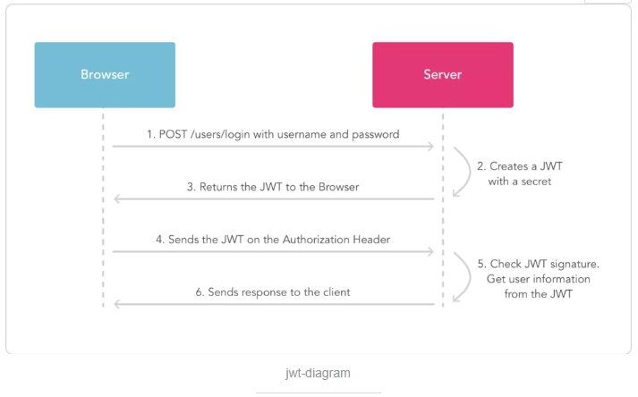

# WebApi项目的搭建

## 一、Learning.WebApi

#### 1.[使用Entity Framework Code First模式构建数据库对象](http://www.cnblogs.com/fzrain/p/3491804.html)

#### 2.[配置JSON的返回驼峰式命名格式](http://www.cnblogs.com/fzrain/p/3520442.html)

#### 3.[设置WebApi返回类型为json格式](https://www.cnblogs.com/sky-net/p/5956538.html)
* 清除所有的返回的xml格式：
```csharp  
   // 找到Global.asax文件，在Application_Start()方法中添加一句：
   GlobalConfiguration.Configuration.Formatters.XmlFormatter.SupportedMediaTypes.Clear();
   // 找到App_Start中的WebApiConfig.cs文件，打开找到Register(HttpConfiguration config)方法，添加以下代码:
   config.Formatters.Clear();
   config.Formatters.Add(new JsonMediaTypeFormatter());
```
* 自定义返回类型(返回类型为HttpResponseMessage)：`JsonContentNegotiator.cs`
```csharp
   // 找到App_Start中的WebApiConfig.cs文件，打开找到Register(HttpConfiguration config)方法，添加以下代码:
   var jsonFormatter = new JsonMediaTypeFormatter(); 
   config.Services.Replace(typeof(IContentNegotiator), new JsonContentNegotiator(jsonFormatter)); 
```
##### 3.1 不希望Json接口暴露的属性，这里我们用 JsonIgnore 标记
```csharp
  [JsonIgnore]
  public DateTime Birthday { get; set; }
```
##### 3.2 设置Json数据接口属性的排序，可以使用 JsonProperty(Order = 1) 
```csharp
public class MoStudent
{
    //[DataMember(Order = 1)]
    [JsonProperty(Order = 1)]
    public DateTime Birthday { get; set; }

    //[DataMember(Order = 0)]
    [JsonProperty(Order = 0)]
    public int Id { get; set; }

    //[DataMember(Order = 1)]
    [JsonProperty(Order = 1)]
    public string Name { get; set; }

    //[DataMember(Order = 2)]
    [JsonProperty(Order = 2)]
    public bool Sex { get; set; }

}
```
#### 4.[用Ninject实现依赖注入](http://www.cnblogs.com/fzrain/p/3520442.html)

#### 5.[Web Api的安全性](https://www.cnblogs.com/fzrain/p/3552423.html)
* 在Web Api中强制使用Https
* 使用Basic Authentication验证用户

#### 6.[使用CacheCow和ETag实现本机内存缓存资源](http://www.cnblogs.com/fzrain/p/3618887.html)

#### 7.[使用CacheCow在SQL Server端实现缓存](http://www.cnblogs.com/fzrain/p/3618887.html)

#### 8.[基于特性路由（Attribute Routing）](http://www.cnblogs.com/fzrain/p/3591040.html)


## 二、WebApi.Jwt
Authentication for ASP.NET Web Api using simple JWT

#### 1.[WebApi使用JWT认证](https://www.cnblogs.com/wangyulong/p/8727683.html)

#### 2.[什么是JWT ? -- JSON WEB TOKEN](https://www.jianshu.com/p/576dbf44b2ae)
###### 注意：secret是保存在服务器端的，jwt的签发生成也是在服务器端的，secret就是用来进行jwt的签发和jwt的验证，所以，它就是你服务端的私钥，在任何场景都不应该流露出去。一旦客户端得知这个secret, 那就意味着客户端是可以自我签发jwt了。
##### 如何应用
一般是在请求头里加入`Authorization`，并加上`Bearer`标注：
```js
fetch('api/user/1', {
  headers: {
    'Authorization': 'Bearer ' + token
  }
})
```
服务端会验证token，如果验证通过就会返回相应的资源。整个流程就是这样的:

##### 优点
* 因为json的通用性，所以JWT是可以进行跨语言支持的，像JAVA,JavaScript,NodeJS,PHP等很多语言都可以使用。
* 因为有了payload部分，所以JWT可以在自身存储一些其他业务逻辑所必要的非敏感信息。
* 便于传输，jwt的构成非常简单，字节占用很小，所以它是非常便于传输的。
* 它不需要在服务端保存会话信息, 所以它易于应用的扩展

## 三、JwtDemo
#### [基于JWT的web api身份验证及跨域调用实践](https://www.cnblogs.com/lwhkdash/p/6686999.html)
#### [WebApi 跨域问题解决方案：CORS](https://www.cnblogs.com/landeanfen/p/5177176.html)
* IE8、9的浏览器是部分支持CORS的解决方案：
* 在调用处指定`jQuery.support.cors = true; `这一句就能解决
```js
jQuery.support.cors = true;
var ApiUrl = "http://localhost:27221/";
$(function () {
    $.ajax({
        type: "get",
        url: ApiUrl + "api/Charging/GetAllChargingData",
        data: {},
        success: function (data, status) {
            if (status == "success") {
                $("#div_test").html(data);
            }
        },
        error: function (e) {
            $("#div_test").html("Error");
        },
        complete: function () {

        }
    });
});
```
* 如果需要对请求进行身份验证
```js
jQuery.support.cors = true;
var ApiUrl = "http://localhost:27221/";
$(function () {
    $.ajax({
        type: "get",
        url: ApiUrl + "api/Charging/GetAllChargingData",
        data: {},
        crossDomain: true,
        xhrFields: {
            withCredentials: true
        },
        success: function (data, status) {
            if (status == "success") {
                $("#div_test").html(data);
            }
        },
        error: function (e) {
            $("#div_test").html("Error");
        },
        complete: function () {

        }
    });
});
```
* 注意这个两句话：crossDomain: true,xhrFields: {withCredentials: true}
